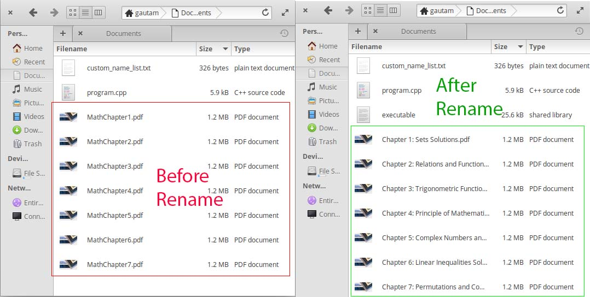
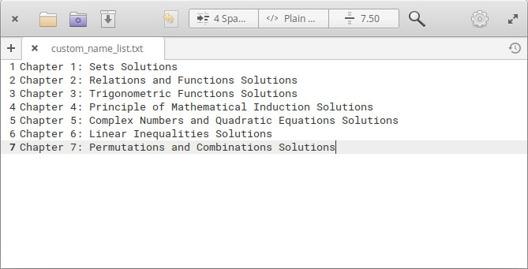
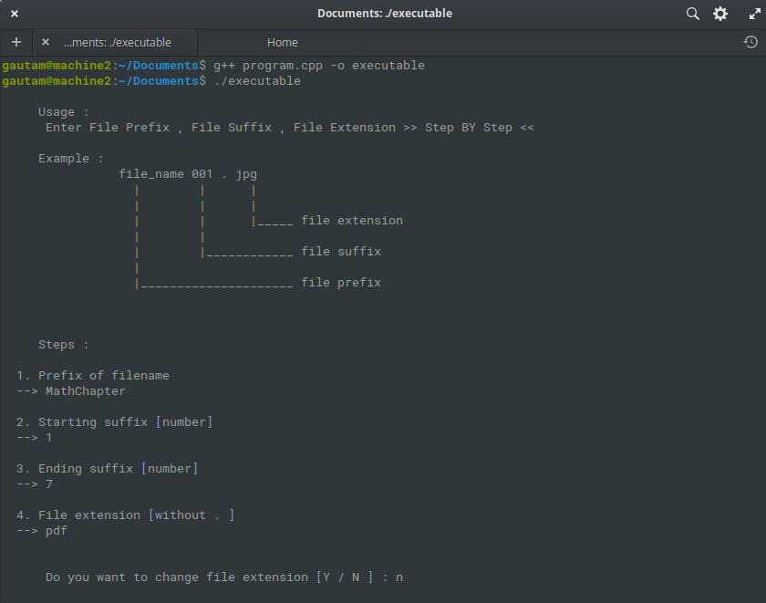
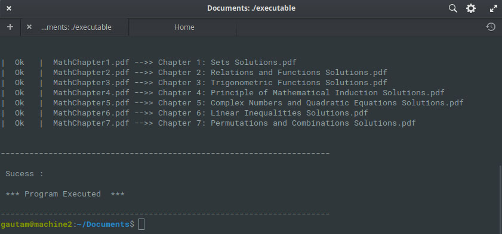

# Batch-File-Rename

## ---=== A Program To rename thousands of files if they are in order ===---

### This Example will show How it works

- Step 1 : Copy all the orderd files and C++ script into a separate directory and put your file names on each line in  **custom_name_list.txt** and make sure that the total number of line must match with **total number of files**

- 2 > compile c++ program than execute and put file **prefix** and **suffix** from starting number to terminating number as you were asked during execution .

- 3 > If you follow the steps correctlly .. **Than Program terminates sucessfully without any errors/warnings**

## If you are a windows user than use any gcc compiler software to compile this program
